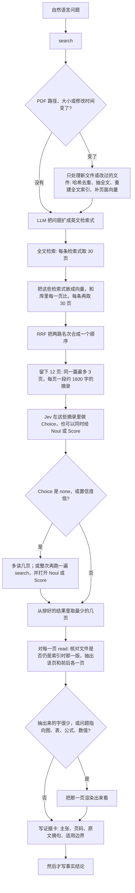

# Local Paper Retrieval

页级混合检索。输入是一个自然语言问题，输出是回到原 PDF 核对过的证据。全文命中、页向量相似度和 Jev 概率只负责定位，不能代替原文。

## 流程

文献库未变化时不重建索引。有变化时只处理新增或修改的 PDF：用 SHA-256 去重，抽取全文，重建全文索引，并只为还没有向量的页补嵌入。语言模型或嵌入接口失败时，保留仍然可用的检索路，并在结果中标明降级。Jev 失败时，改由语言模型按摘录里的显式证据打 0–3 分。

## 检索

查询扩展把问题写成少数英文检索式，保留方法名、指标、数据集和原问题。

全文检索使用 SQLite FTS5，按 BM25 排序。每条检索式返回至多 30 页。单位是页，不是整篇文档。

向量检索只嵌入检索式。页向量在建索引时已经写入，用余弦相似度与全库页向量比较，每条检索式再取至多 30 页。全文检索返回的页面不会再次嵌入。

两路名次用 Reciprocal Rank Fusion 合并。某一页在某一路的名次为 r 时，该路贡献 `1/(60+r)`。同一页在多路中都靠前，融合分更高。

融合之后截断为至多 12 页，同一文档至多 3 页。每页附一段约 1600 字的摘录，窗口对准检索词首次出现的位置。

## 裁定与核对

Jev 对短名单做 Choice，选项包含 `none`。`--jev-noul` 与 `--jev-score` 在同一次调用里追加适切性判断和证据强度。Choice 为 `none` 或置信度低时，第一名不算已核实。

`read` 从原 PDF 重新抽取目标页及其前后各一页。文件大小和修改时间与索引一致时不重算 SHA-256。抽取文本过短，或问题指向图、表、公式、数值时，才渲染该页。

事实陈述之前先形成证据卡：主张、支持程度（`direct`、`partial`、`not_found`）、文档标识、标题、页码、可见的章节或图表编号、短原文或明确标出的转述，以及不能外推的边界。Jev 的 Choice、Noul、Score 和重排理由都不是证据。跨文档综合标为推断。

## 依赖

Python，以及 Poppler 的 `pdftotext` 与 `pdfinfo`。查询扩展和页向量各需要一个模型接口。TypeSafe 提供 Jev；缺失时使用语言模型重排。
