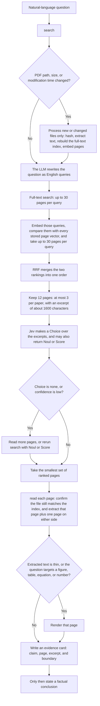

# Private KB retrieve

**English** · [中文](README.zh.md)

Find the page in a private PDF library, then verify it on the original PDF.

Full-text search and stored page vectors locate candidate pages. **Jev integrated** then judges whether an excerpt actually answers. The original PDF remains the evidence.

## Jev integrated

Rank fusion only knows which pages matched. It does not know whether the text on the page can answer the question. Jev sits on the shortlist and makes that judgment before any fact is stated.

- It chooses the excerpt that contains the needed fact, or `none` when every excerpt is only topically related.
- A `none` or a low confidence stops the top-ranked page from being treated as the answer. The agent reads further instead of defending rank 1.
- Suitability and evidence strength can be requested in that same judgment, so each page can be kept or dropped without a second retrieval pass.
- The judgment is confined to the excerpt in hand. A page is not promoted because the answer might appear somewhere else in the paper.
- The chosen page is still re-read from the original PDF. Jev decides where to look. It does not become the citation.

## Use when

- The question is about papers already in a local library
- The answer needs a PDF page, not a file name
- A citation has to be checked against the original page
- A web result would be the wrong source

## Setup

Point any agent that can read instructions and run commands at [`SKILL.md`](SKILL.md).

Put PDFs in `papers/`. Put model settings in `.env` beside `SKILL.md`:

```
llmurl=
llmmodel=
llmkey=
emburl=
embmodel=
embkey=
TYPESAFE_API_KEY=
```

`llmurl`, `llmmodel`, and `llmkey` expand the question. `emburl`, `embmodel`, and `embkey` embed the queries. `TYPESAFE_API_KEY` enables Jev. Without it, reranking uses the language model.

From the skill root:

```bash
python scripts/library.py search "Which page defines the evaluation protocol?"
python scripts/library.py read <doc_id> --page <pdf_page> --context 1
```

Do not run `sync` first. `search` refreshes the index when a PDF is added or changed.

Requires the Python packages `numpy`, `openai`, and `python-dotenv`, plus Poppler's `pdftotext` and `pdfinfo`.

## What the agent does



An unchanged library does not trigger a rebuild. When files change, only new or modified PDFs are processed: SHA-256 deduplication, text extraction, a rebuilt full-text index, and embeddings for pages that do not yet have one. If the language-model or embedding call fails, the remaining retrieval channel is kept and the result records the degradation. If Jev fails, the language model scores explicit evidence in each excerpt from 0 to 3.

## How a page is chosen

Query expansion rewrites the question into a few English queries and keeps method names, metrics, datasets, and the original question.

Full-text search uses SQLite FTS5 with BM25. Each query returns at most 30 pages. The unit is a page, not a whole document.

Vector search embeds the queries only. Page vectors are already stored. Each query is compared with those vectors by cosine similarity and returns at most 30 pages. Full-text hits are not embedded again.

Reciprocal rank fusion merges the two lists. A page at rank r in one list contributes `1/(60+r)` from that list. The fused list is cut to 12 pages, at most 3 from the same document, each with an excerpt of about 1600 characters around the first matched term.

Jev chooses among those excerpts, including `none`. `--jev-noul` and `--jev-score` add suitability and evidence strength in the same call. A Choice of `none`, or low confidence, means the top rank is not yet verified. The agent then re-reads the original page and writes an evidence card before stating a fact. A Jev score is not evidence.
