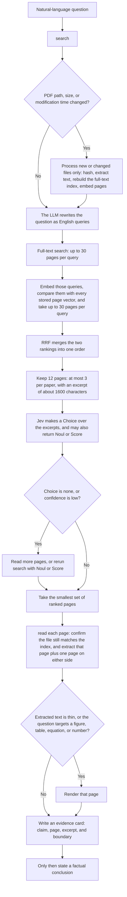

# Find the page. Verify it on the original PDF.

**English** · [中文](README.zh.md)

Page-level retrieval for a local PDF library. Full-text search and stored page vectors locate the page. Reciprocal rank fusion and Jev only rank excerpts. The original PDF is the evidence.

## Use

This repository is an agent skill. Any agent that can read instructions and run commands can use it. Point the agent at `SKILL.md`.

Put PDFs in `papers/`. Put model settings in `.env` next to `SKILL.md`:

```
llmurl=
llmmodel=
llmkey=
emburl=
embmodel=
embkey=
TYPESAFE_API_KEY=
```

`llmurl`, `llmmodel`, and `llmkey` expand the question. `emburl`, `embmodel`, and `embkey` embed the queries. `TYPESAFE_API_KEY` enables Jev. Without it, reranking uses the language model.

From the skill root, ask in natural language. Do not run `sync` first. `search` refreshes the index when a PDF was added or changed, then returns pages. `read` re-extracts the chosen page from the original PDF. Write an evidence card before stating a fact.

```bash
python scripts/library.py search "Which page defines the evaluation protocol?"
python scripts/library.py read <doc_id> --page <pdf_page> --context 1
```

Python packages: `numpy`, `openai`, `python-dotenv`. System tools: Poppler's `pdftotext` and `pdfinfo`.

## Pipeline



An unchanged library does not trigger a rebuild. When files change, only new or modified PDFs are processed: SHA-256 deduplication, text extraction, a rebuilt full-text index, and embeddings for pages that do not yet have one. If the language-model or embedding call fails, the remaining retrieval channel is kept and the result records the degradation. If Jev fails, the language model scores explicit evidence in each excerpt from 0 to 3.

## Retrieval

Query expansion rewrites the question into a few English queries. It preserves method names, metrics, datasets, and the original question.

Full-text search uses SQLite FTS5 with BM25 ranking. Each query returns at most 30 pages. The unit is a page, not a whole document.

Vector search embeds the queries only. Page vectors are already stored in the index. Each query is compared with every stored page vector by cosine similarity and again returns at most 30 pages. Pages returned by full-text search are not embedded again.

The two rankings are merged by reciprocal rank fusion. A page at rank r in one list contributes `1/(60+r)` from that list. A page that ranks high in several lists receives a higher fused score.

The fused order is then cut to at most 12 pages, with at most 3 pages from the same document. Each page carries an excerpt of about 1600 characters, centered on the first matched term.

## Judgment and verification

Jev runs a Choice over the shortlist. The options include `none`. `--jev-noul` and `--jev-score` add a suitability judgment and an evidence-strength score in the same call. A Choice of `none`, or a low confidence, means the top rank is not yet verified.

`read` extracts the selected page and one neighboring page on each side from the original PDF. SHA-256 is recomputed only when the file size or modification time no longer matches the index. The page is rendered when the extracted text is thin, or when the question targets a figure, table, equation, or number.

A factual statement is preceded by an evidence card: the claim, the support status (`direct`, `partial`, or `not_found`), the document identifier, the title, the PDF page, any visible section or figure label, a short quotation or a clearly marked paraphrase, and the boundary beyond which the source should not be stretched. A Jev Choice, Noul, Score, or reranking reason is not evidence. A synthesis across documents is labeled as inference.
