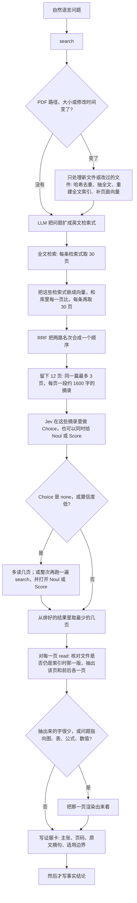

# Private KB retrieve

[English](README.md) · **中文**

在私人 PDF 文献库里找到那一页，再回到原 PDF 核对。

全文检索和已存页向量负责找出候选页。**Jev integrated** 接着判断摘录本身能不能回答问题。证据仍然只来自原 PDF。

## Jev integrated

排序融合只知道哪些页匹配上了，不知道页上的文字能不能回答问题。Jev 接在短名单之后，在写下任何事实之前做这个判断。

- 它选出真正含有所需事实的摘录；如果每段都只是话题相关，就返回 `none`。
- `none` 或置信度低时，不会把排名第一的页当成答案。Agent 会继续读，而不是维护这个名次。
- 适切性和证据强度可以在同一次判断里给出，不必为了取舍页面再检索一遍。
- 判断只针对手里的这段摘录。不会因为答案可能出现在论文的其他页，就把这一页提前。
- 选中的页仍会回到原 PDF 重读。Jev 决定去看哪里，自己并不成为引用。

## 何时使用

- 问题针对的是已经在本地文献库里的论文
- 需要的是 PDF 页码，而不是文件名
- 引用必须回到原页核对
- 网页检索不是该用的来源

## 准备

把 [`SKILL.md`](SKILL.md) 交给任何能读指令、能执行命令的 agent。

PDF 放在 `papers/`。模型配置写在 `SKILL.md` 旁边的 `.env`：

```
llmurl=
llmmodel=
llmkey=
emburl=
embmodel=
embkey=
TYPESAFE_API_KEY=
```

`llmurl`、`llmmodel`、`llmkey` 用于把问题扩成检索式。`emburl`、`embmodel`、`embkey` 用于嵌入检索式。`TYPESAFE_API_KEY` 启用 Jev。没有它时，改由语言模型重排。

在 skill 根目录：

```bash
python scripts/library.py search "哪一页定义了评估协议？"
python scripts/library.py read <doc_id> --page <pdf_page> --context 1
```

不要先运行 `sync`。PDF 有增改时，`search` 会自己更新索引。

需要 Python 包 `numpy`、`openai`、`python-dotenv`，以及 Poppler 的 `pdftotext` 和 `pdfinfo`。

## Agent 会做什么



文献库未变化时不重建索引。有变化时只处理新增或修改的 PDF：用 SHA-256 去重，抽取全文，重建全文索引，并只为还没有向量的页补嵌入。语言模型或嵌入接口失败时，保留仍然可用的检索路，并在结果中标明降级。Jev 失败时，改由语言模型按摘录里的显式证据打 0–3 分。

## 一页是怎么选出来的

查询扩展把问题写成少数英文检索式，并保留方法名、指标、数据集和原问题。

全文检索使用 SQLite FTS5，按 BM25 排序。每条检索式至多返回 30 页。单位是页，不是整篇文档。

向量检索只嵌入检索式。页向量已经存在。每条检索式用余弦相似度与这些向量比较，再取至多 30 页。全文检索命中的页不会再次嵌入。

Reciprocal rank fusion 合并两路名次。某一页在某一路的名次为 r 时，该路贡献 `1/(60+r)`。融合后留下至多 12 页，同一文档至多 3 页，每页一段约 1600 字、对准首次命中词的摘录。

Jev 在这些摘录里做 Choice，选项包含 `none`。`--jev-noul` 与 `--jev-score` 在同一次调用里追加适切性和证据强度。Choice 为 `none` 或置信度低时，第一名尚未核实。Agent 随后重读原页，先写证据卡，再陈述事实。Jev 的分数不是证据。
